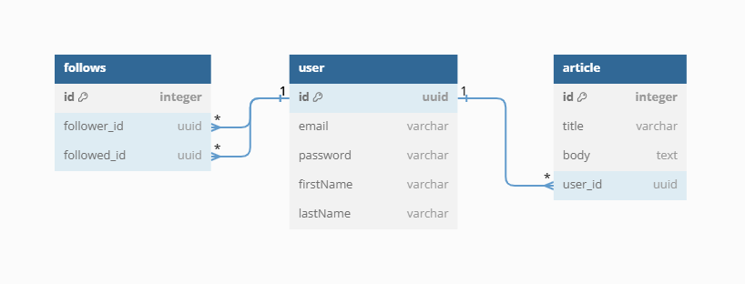

<p align="center">
  <a href="http://nestjs.com/" target="blank"></a>
</p>

# NestJS CRUD Application

This project is a backend application for a Blog built with NestJS. It allows users to create and query articles with features such as following other users and pagination for queries.

> Note: This project was created as part of the Software Engineering Bootcamp by the [Masar Program](https://x.com/devWithSANI) from [SANI](https://masarbysani.com). It is intended for educational purposes and to successfully complete the bootcamp.

## Database Schema



### Tables

#### User
| Column     | Type    | Constraints                       |
|------------|---------|-----------------------------------|
| id         | uuid    | primary key, increment            |
| email      | varchar |                                   |
| password   | varchar |                                   |
| firstName  | varchar |                                   |
| lastName   | varchar |                                   |

#### Article
| Column     | Type    | Constraints                       |
|------------|---------|-----------------------------------|
| id         | integer | primary key, increment            |
| title      | varchar |                                   |
| body       | text    |                                   |
| user_id    | uuid    | foreign key references user(id)   |

#### Follows
| Column       | Type    | Constraints                       |
|--------------|---------|-----------------------------------|
| id           | integer | primary key, increment            |
| follower_id  | uuid    | foreign key references user(id)   |
| followed_id  | uuid    | foreign key references user(id)   |

### Relationships

- `article.user_id` references `user.id` (many-to-one)
- `follows.follower_id` references `user.id` (many-to-one)
- `follows.followed_id` references `user.id` (many-to-one)

### View Schema on dbdiagram.io

<details>
  <summary>Click to view and copy the schema for <a href="https://dbdiagram.io/">dbdiagram.io</a></summary>

  ```plaintext
  Table user {
    id uuid [primary key, increment]
    email varchar
    password varchar
    firstName varchar
    lastName varchar
  }

  Table article {
    id integer [primary key, increment]
    title varchar
    body text
    user_id uuid
  }

  Table follows {
    id integer [primary key, increment]
    follower_id uuid
    followed_id uuid
  }

  Ref: article.user_id > user.id // many_to_one
  Ref: follows.follower_id > user.id // many_to_one
  Ref: follows.followed_id > user.id // many_to_one
  ```
</details>

## Project setup

```bash
$ npm install
```

## Compile and run the project

```bash
# development
$ npm run start

# watch mode
$ npm run start:dev

# production mode
$ npm run start:prod
```

## Run tests

```bash
# unit tests
$ npm run test

# e2e tests
$ npm run test:e2e

# test coverage
$ npm run test:cov
```

## Deployment

When you're ready to deploy your NestJS application to production, there are some key steps you can take to ensure it runs as efficiently as possible. Check out the [deployment documentation](https://docs.nestjs.com/deployment) for more information.

If you are looking for a cloud-based platform to deploy your NestJS application, check out [Mau](https://mau.nestjs.com), our official platform for deploying NestJS applications on AWS. Mau makes deployment straightforward and fast, requiring just a few simple steps:

```bash
$ npm install -g mau
$ mau deploy
```

With Mau, you can deploy your application in just a few clicks, allowing you to focus on building features rather than managing infrastructure.

## Resources

Check out a few resources that may come in handy when working with NestJS:

<details>

- Visit the [NestJS Documentation](https://docs.nestjs.com) to learn more about the framework.
- For questions and support, please visit our [Discord channel](https://discord.gg/G7Qnnhy).
- To dive deeper and get more hands-on experience, check out our official video [courses](https://courses.nestjs.com/).
- Deploy your application to AWS with the help of [NestJS Mau](https://mau.nestjs.com) in just a few clicks.
- Visualize your application graph and interact with the NestJS application in real-time using [NestJS Devtools](https://devtools.nestjs.com).
- Need help with your project (part-time to full-time)? Check out our official [enterprise support](https://enterprise.nestjs.com).
- To stay in the loop and get updates, follow us on [X](https://x.com/nestframework) and [LinkedIn](https://linkedin.com/company/nestjs).
- Looking for a job, or have a job to offer? Check out our official [Jobs board](https://jobs.nestjs.com).

</details>

## License

This project was created as part of the Software Engineering Bootcamp by the [Masar Program](https://x.com/devWithSANI) from [SANI](https://masarbysani.com). It is intended for educational purposes and to successfully complete the bootcamp.

Nest is [MIT licensed](https://github.com/nestjs/nest/blob/master/LICENSE).